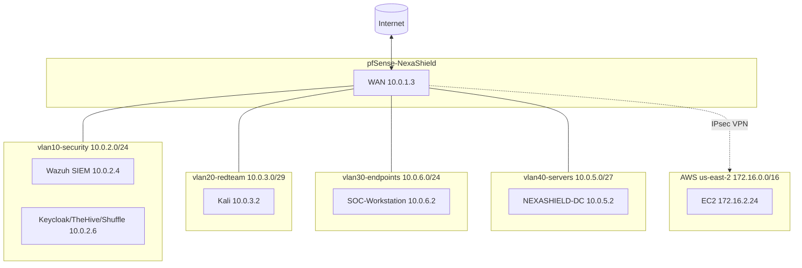
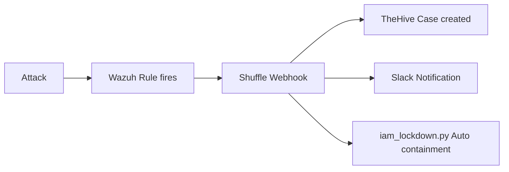
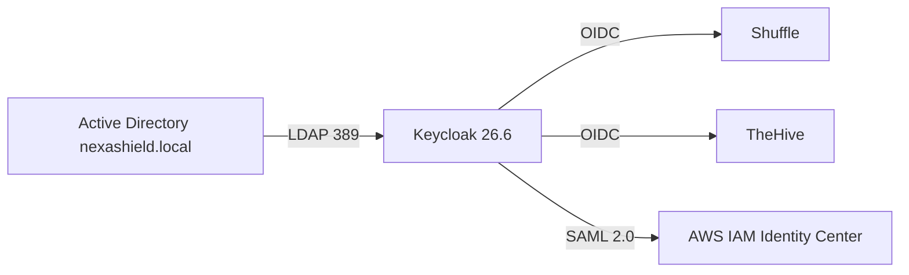

# NexaShield Architecture Diagrams

Three diagrams covering the network layout, SOAR pipeline,
and identity chain. Paste any block into https://mermaid.live
to render and export as PNG or SVG.

## Network Architecture

## SOAR Pipeline

## Identity Chain

